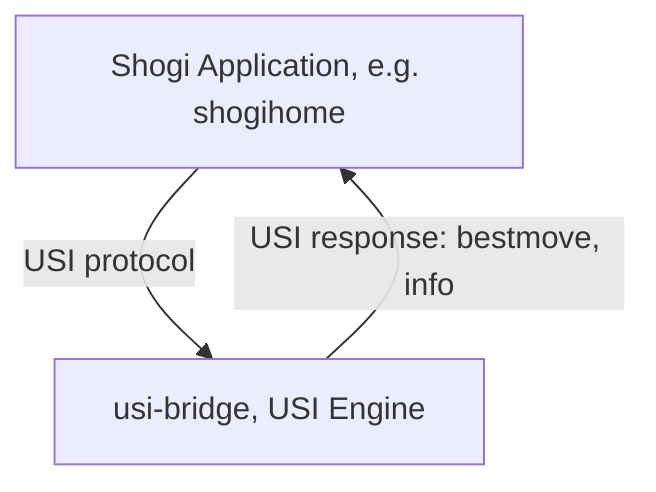

# shogithink

A modular system that combines Shogi AI with AI-driven commentary to explain positions, best moves, and evaluations in natural language

## System Architecture (Mermaid)

## Component Description

- **Shogi Application (e.g. shogihome)**
  - The user connects to the USI engine (usi-bridge) in analysis mode.
  - Sends position and analysis requests via the USI protocol.

- **usi-bridge**
  - Acts as a simple USI engine and receives requests from the Shogi application.
  - Responds to USI commands with static information:
    - For analysis requests (`go`), always returns `info score cp 0` and `bestmove resign`.
    - For `usi` command, returns engine name and author.
    - For `isready` command, returns `readyok`.
  - Does not perform real analysis or communicate with any backend.
  - Provides an HTTP server (port 8080) to view logs of received commands and sent responses.
